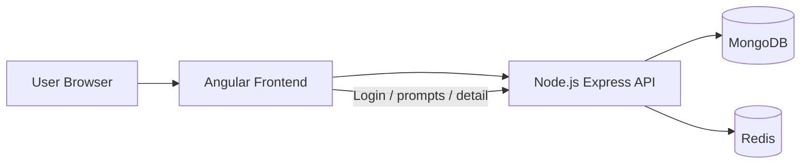

# Application Architecture

## Purpose

This document explains the implementation architecture for the AI Prompt Library and maps it back to the assignment requirements.

## Stack Choice

The assignment preferred Angular, Django, PostgreSQL, and Redis, but explicitly allowed another feasible stack if the preferred one was not practical.

This project uses:

- Frontend: Angular 21
- Backend: Node.js with Express and TypeScript
- Database: MongoDB
- Cache: Redis
- Deployment: Vercel for the frontend, Render for the backend

### Why This Stack Was Chosen

I chose Node.js and MongoDB because I am comfortable shipping with that stack, which helped me keep the implementation focused and stable within the time limit.

Practical advantages:

- MongoDB fits the prompt document shape well, especially the `content` field and `tags` array.
- The document model keeps the backend simple and reduces schema-migration overhead.
- Node.js keeps the API and frontend integration in the same language family, which lowers context switching.
- The stack is straightforward to containerize and deploy.
- The same JavaScript/TypeScript skill set applies across frontend, backend, and tooling, which improves maintainability.

## Requirement Mapping

### Backend Requirements

- Data model: implemented as a prompt document with UUID id, title, content, complexity, created_at, and tags.
- `GET /prompts`: implemented and returns the prompt list.
- `POST /prompts`: implemented and creates a new prompt.
- `GET /prompts/:id`: implemented and returns one prompt.
- Redis view counter: implemented; the detail endpoint increments Redis and returns `view_count`.
- Authentication bonus: implemented with JWT login and a protected create endpoint.
- Tagging bonus: implemented with tag storage and `?tag=...` filtering.

### Frontend Requirements

- Prompt list view: implemented.
- Prompt detail view at `/prompts/:id`: implemented.
- Add prompt form: implemented with reactive form validation.
- Login screen: implemented for protected prompt creation.
- Tag support: implemented in the UI and backed by the API.

### DevOps Requirements

- `docker-compose up --build` brings up frontend, backend, database, and Redis.
- Live hosting is available for the frontend and backend deployment context.

## High-Level Architecture

The frontend is the presentation layer. The backend is the API and business-logic layer. MongoDB stores prompt documents, while Redis stores live view counters and acts as the source of truth for counts.

## Backend Structure

The backend is split into layers so the code stays testable and easy to change:

- `config`: environment, MongoDB, and Redis setup
- `routes`: HTTP route definitions
- `controllers`: request/response orchestration
- `services`: business logic
- `models`: MongoDB access layer
- `middleware`: auth, validation, not-found, and error handling
- `utils`: reusable helpers such as logging and HTTP errors

### Request Flow

1. A request enters a route.
2. Validation middleware checks the payload, query, or params.
3. The controller receives sanitized input.
4. The service performs business logic.
5. The model layer reads or writes MongoDB.
6. Redis is updated for live view counts when a prompt detail is opened.
7. The controller returns the response.

## Redis View Counter Flow

On `GET /prompts/:id`:

1. The prompt is loaded from MongoDB by UUID.
2. The Redis key `prompt:<id>:views` is incremented.
3. The incremented value is returned as `view_count`.
4. Redis is treated as the source of truth for views.

If Redis is unavailable, the endpoint returns `503` rather than returning a misleading count.

## Frontend Structure

The Angular app is organized by feature:

- `pages`: prompt list, prompt detail, add prompt, login
- `shared/components`: reusable UI pieces such as the prompt card
- `core`: API service, auth guard, auth service, and interceptor

The UI follows a simple flow:

1. List prompts.
2. Open a prompt detail page.
3. Track live view count.
4. Log in if needed.
5. Create a new prompt using the protected form.

## Deployment Notes

- Frontend URL: https://emplay-five.vercel.app/
- Backend dashboard: https://dashboard.render.com/
- Docker Compose is used for local parity.
- The app is designed to be production-ready with request validation, security headers, and a clean separation of responsibilities.

## Demo Login

Use the following credentials to test the protected prompt creation flow:

- Username: admin
- Password: admin123

## Postman Collection

A Postman collection is included in [postman/ai-prompts.postman_collection.json](../postman/ai-prompts.postman_collection.json) for:

- Health checks
- Login
- Listing prompts
- Prompt detail lookup
- Tag filtering
- Protected prompt creation

## Summary

This architecture keeps the application simple, practical, and easy to explain in an interview or submission review. It also covers the assignment goals while using a stack that was feasible to complete and stabilize within the time limit.
